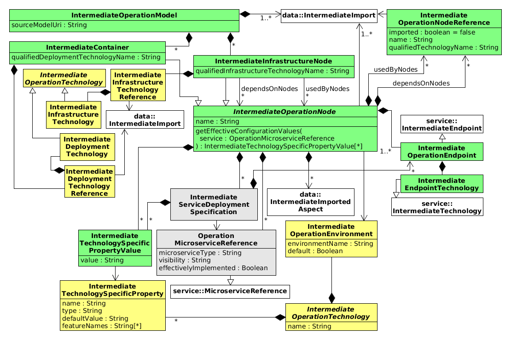

.. sectnum::

.. _Introduction:

Introduction
============

This document describes the Intermediate Operation Model format of the
`Language Ecosystem for Modeling Microservice Archictecture`_. The project aims
to facilitate the development of *microservice-based software systems* 
:cite:`Newman2015` by employing Model-driven Development (MDD) 
:cite:`Combemale2017`.

In this context, a microservice architecture consists of several different types
of models, listed in :numref:`tab__model_types`.

.. _tab__model_types:

.. table:: Model types

    =================   ========================================================
    **Model Type**      **Description**
    -----------------   --------------------------------------------------------
    Domain Data Model   A Domain Data Model describes the domain-specific data 
                        used by a modeled microservice to specify its 
                        input/output data. See also the 
                        :doc:`Intermediate Data Model Format Specification 
                        <data_model:index>`.
    Mapping Model       A Mapping Model allows for assigning (alternative) 
                        technologies to, e.g., modeled microservices in a
                        Service Model and complex types in a Data Model.
    Service Model       A Service Model contains several microservice models, 
                        their interfaces, and operations. The contents of 
                        imported Domain Data Models, e.g., data structures, may 
                        be used to type operations' parameters. See also the 
                        :doc:`Intermediate Service Model Format Specification 
                        <service_model:index>`.
    Operation Model     An Operation Model expresses the deployment and 
                        operation of microservices being imported from Service 
                        Models, and the dependencies to infrastructure nodes,
                        e.g., databases or service discoveries, being imported
                        from Operation Models.
    Technology Model    A Technology models encapsulates descriptions of 
                        technologies. For instance, certain implementation 
                        technologies, e.g., Java or Go, and protocol 
                        technologies, e.g., REST or AMQP, may be contained in a
                        Technology Model. Moreover, service or operation 
                        *aspects* :cite:`Kiczales1997` may be defined, which 
                        enable to reify technology specifications in Mapping, 
                        Operation, or Service Models.
    =================   ========================================================

.. _ModelProcessing:

Model Processing
================
The creation of the models happens within a bundle of Eclipse [#eclipse]_ 
plugins that are based on Xcore [#xcore]_ and Xtext [#xtext]_. These 
technologies build upon the Ecore metamodeling standard :cite:`Steinberg2011`
and the Eclipse Modeling Framework (EMF) [#emf]_.

However, to detach the processing of the models from the Eclipse ecosystem and 
allow microservice teams for creating custom model processors like validators 
and *code generators* :cite:`Combemale2017` that do not need to depend on EMF, 
the models are exported [#model-export]_ from Eclipse to the technology-agnostic
XML Metadata Interchange (XMI) format [#xmi]_.

XMI is based on XML and encodes a model instance, whose *metamodel*
:cite:`Combemale2017` is based on the Meta Object Facility (MOF) [#mof]_ which
is generally the case for Ecore metamodels and derived model instances.

Format Specification
====================
This document describes the metamodel and thus the structure of XMI files of
Intermediate Operation Models, i.e., instances of Operation Models that were 
exported from Eclipse (cf. :ref:`Introduction` and :ref:`ModelProcessing`). It 
may be used as reference, when implementing custom model processors for 
microservice-related Operation Models.

:numref:`fig_metamodel` shows the structure of the metamodel of the Intermediate
Operation Models in an object-oriented way in the form of a UML class diagram.
The modeling concepts, their properties, and relationships are depicted as
classes, attributes, and associations, respectively.

.. _fig_metamodel:

    Metamodel of Intermediate Operation Models

In the following, the document contains a reference of each modeling concept of 
the metamodel depicted in :numref:`fig_metamodel`.

.. HINT::

    Attributes that may contain more than one value but exhibit a ``*`` 
    multiplicity, i.e., they may contain an arbitrary number of values or even
    none at all (``*`` is shorthand UML notation for ``0..*``), are never null.

    In case no multiplicity is stated after the object type of an attribute, the
    attribute may be null. For example, an attribute defined as ``String name``
    implicitly has a multiplicity ``0..1`` and in the zero-case the String may
    be null.

    However, in case the attribute's type is a built-in primitive Java type, 
    e.g. ``int``, the attribute will never be null but exhibits the type's 
    default value in case it did not receive an explicit value.

Model Root
----------

.. java:type:: class IntermediateOperationModel
    
    Root of the Intermediate Operation Model instance.

    .. py:attribute:: String[1] sourceModelUri

        `\"file\"` URI pointing to the source Operation Model file from which 
        this model was derived.

        .. NOTE::

            Model processors must not depend on this URI being absolute or
            relative. Both cases may occur in practice and are totally up to the
            modeler.

    .. py:attribute:: IntermediateImport[*] imports

        References to :java:type:`data_model:IntermediateDataModel` or
        Technology Model (cf. :numref:`tab__model_types`) instances that were
        imported into the source Operation Model
        (cf. :java:type:`data_model:IntermediateImport`).

    .. _link__IntermediateOperationModel_containers:

    .. py:attribute:: IntermediateContainer[*] containers

        Modeled :java:type:`containers <IntermediateContainer>` in the source
        Operation Model.

        .. HINT::

            The source Operation Model must not be empty. Consequent, both the
            :ref:`containers <link__IntermediateOperationModel_containers>`
            and
            :ref:`infrastructureNodes <link__IntermediateOperationModel_infrastructureNodes>`
            attributes of an Intermediate Operation Model instance may never be
            empty at the same time.

    .. _link__IntermediateOperationModel_infrastructureNodes:

    .. py:attribute:: IntermediateInfrastructureNode[*] infrastructureNodes

        Modeled
        :java:type:`infrastructure nodes <IntermediateInfrastructureNode>`
        in the source Operation Model.

        .. HINT::

            The source Operation Model must not be empty. Consequent, both the
            :ref:`containers <link__IntermediateOperationModel_containers>`
            and
            :ref:`infrastructureNodes <link__IntermediateOperationModel_infrastructureNodes>`
            attributes of an Intermediate Operation Model instance may never be
            empty at the same time.

Operation Nodes
---------------

.. java:type:: class IntermediateOperationNode

    Abstract super class of :java:type:`IntermediateContainer` and
    :java:type:`IntermediateInfrastructureNode`.
    
    .. _link__IntermediateOperationNode_name:

    .. py:attribute:: String[1] name

        Unique name of the operation node.

    .. _link__IntermediateOperationNode_getEffectiveConfigurationValues:

    .. py:method:: getEffectiveConfigurationValues(service : OperationMicroserviceReference) -> IntermediateTechnologySpecificPropertyValue[*]

        Helper to return the effective configuration values on the operation
        node being set for the given
        :java:type:`OperationMicroserviceReference`. The effective configuration
        values consist of the 
        :ref:`default values <link__IntermediateOperationNode_defaultValues>`
        for the
        :java:type:`technology-specific properties <IntermediateTechnologySpecificPropertyValue>`
        on the node and the
        :ref:`property values specific to the service's deployment <link__IntermediateServiceDeploymentSpecification_propertyValues>`.
        The latter ones may overwrite the default values.

    .. _link__IntermediateOperationNode_imports:

    .. py:attribute:: IntermediateImport[1..*] imports

        References to Technology Model (cf. :numref:`tab__model_types`)
        instances that were imported into the source Operation Model
        (cf. :java:type:`data_model:IntermediateImport`).

    .. _link__IntermediateOperationNode_operationEnvironment:
    
    .. py:attribute:: IntermediateOperationEnvironment[1] operationEnvironment

        Intermediate representation of the node's
        :java:type:`operation environment <IntermediateOperationEnvironment>`.

    .. _link__IntermediateOperationNode_deployedServices:

    .. py:attribute:: OperationMicroserviceReference[*] deployedServices

        :java:type:`References <OperationMicroserviceReference>` to the
        microservices being associated with the node.

        .. NOTE::

            Despite the name `\"deployedServices"`, this attribute also concerns
            the microservices that **use** the node, in case the concrete
            instance of the node is an
            :java:type:`IntermediateInfrastructureNode`.

    .. _link__IntermediateOperationNode_endpoints:

    .. py:attribute:: IntermediateOperationEndpoint[1..*] endpoints

        Intermediate representations of the node's
        :java:type:`endpoints <IntermediateOperationEndpoint>`.

    .. _link__IntermediateOperationNode_specifications:

    .. py:attribute:: IntermediateServiceDeploymentSpecification[*] specifications

        Intermediate representations of
        :java:type:`service-specific deployment specifications <IntermediateServiceDeploymentSpecification>`
        for services being 
        :ref:`associated <link__IntermediateOperationNode_deployedServices>`
        with the node.

    .. _link__IntermediateOperationNode_defaultValues:

    .. py:attribute:: IntermediateTechnologySpecificPropertyValue[*] defaultValues

        Default values for
        :java:type:`technology-specific configuration property values <IntermediateTechnologySpecificPropertyValue>`.
        These values account all services being 
        :ref:`associated <link__IntermediateOperationNode_deployedServices>`
        with the node.

        .. HINT::
            
            You may use the :ref:`getEffectiveConfigurationValues <link__IntermediateOperationNode_getEffectiveConfigurationValues>`
            method to retrieve the effective configuration values of a given
            associated service.

    .. _link__IntermediateOperationNode_aspects:

    .. py:attribute:: IntermediateImportedAspect[*] aspects

        Intermediate representations of
        :java:type:`aspects <IntermediateImportedAspect>` being imported from
        Technology Models (cf. :numref:`tab__model_types`) and applied to the
        node.

.. java:type:: class IntermediateOperationEndpoint

    Intermediate representation of an endpoint on an
    :java:type:`IntermediateOperationNode`. This representation extends the
    :java:type:`service_model:IntermediateEndpoint` concept from the
    Intermediate Service Model specification by the endpoint's technology.

    .. _link__IntermediateOperationEndpoint_endpointTechnology:

    .. py:attribute:: IntermediateOperationEndpoint[*] endpointTechnology

        Technology used by the endpoint.

    .. _link__IntermediateOperationEndpoint_node:

    .. py:attribute:: IntermediateOperationNode[1] node

        Operation node for which the endpoint was specified.

.. java:type:: class IntermediateEndpointTechnology

    Intermediate representation of the technology used by an
    :java:type:`IntermediateOperationEndpoint`. This representation derives from
    the :java:type:`service_model:IntermediateTechnology` concept of the
    Intermediate Service Model specification to make endpoint technology
    information specific to Operation Models.

    .. _link__IntermediateEndpointTechnology_endpoint:

    .. py:attribute:: IntermediateOperationEndpoint[1] endpoint

        The endpoint to which this technology was assigned.

.. java:type:: class IntermediateTechnologySpecificPropertyValue

    Represents the value of a
    :java:type:`technology-specific property <IntermediateTechnologySpecificProperty>`.
    
    .. _link__IntermediateTechnologySpecificPropertyValue_value:

    .. py:attribute:: String[1] value

        The value of the property.

        .. HINT::

            The value is represented as a String, but will always be compatible
            to the
            :ref:`type <link__IntermediateTechnologySpecificProperty_type>` of
            the :java:type:`IntermediateTechnologySpecificProperty`.

    .. _link__IntermediateTechnologySpecificPropertyValue_technologySpecificProperty:

    .. py:attribute:: IntermediateTechnologySpecificProperty[1] technologySpecificProperty

        The :java:type:`IntermediateTechnologySpecificProperty` to which the
        value was assigned.

    .. _link__IntermediateTechnologySpecificPropertyValue_specification:

    .. py:attribute:: IntermediateServiceDeploymentSpecification specification

        The service deployment specification being configured by this value.

    .. _link__IntermediateTechnologySpecificPropertyValue_operationNode:

    .. py:attribute:: IntermediateOperationNode operationNode

        The operation node being configured by this value.

.. java:type:: class IntermediateContainer

    This class represents a container as a certain kind of
    :java:type:`operation node <IntermediateOperationNode>`.

    .. py:attribute String qualifiedDeploymentTechnologyName

        Qualified name of the deployment technology, which is used on the
        container.

    .. _link__IntermediateContainer_technologyReference:

    .. py:attribute:: IntermediateDeploymentTechnologyReference[1] technologyReference

        Intermediate representation of the reference to the
        :java:type:`deployment technology <IntermediateDeploymentTechnologyReference>`
        being used by the container.

    .. _link__IntermediateContainer_operationModel:

    .. py:attribute:: IntermediateOperationModel[1] operationModel

        The operation model to which the container belongs.

    .. _link__IntermediateContainer_dependsOnNodes:

    .. py:attribute:: IntermediateOperationNodeReference[*] dependsOnNodes

        A container may depend on other nodes, e.g., databases or service
        discoveries that deployed microservices require.

    .. _link__IntermediateContainer_usedByNodes:

    .. py:attribute:: IntermediateOperationNodeReference[*] usedByNodes

        A container may be used by other nodes that make use of its
        infrastructure-related capabilities.

        .. NOTE::

            The `\"usedByNodes\"` attribute models the dependency of another
            node on a container. The
            :ref:`dependsOnNodes <link__IntermediateContainer_dependsOnNodes>`
            attribute takes the opposite perspective and reflects the dependency
            of a container on another node.

    .. _link__IntermediateContainer_reference:

.. java:type:: class IntermediateInfrastructureNode

    This class represents an infrastructure node as a certain kind of
    :java:type:`operation node <IntermediateOperationNode>`.

    .. py:attribute:: String qualifiedInfrastructureTechnologyName

        Qualified infrastructure technology name, which is used by the
        infrastructure node.

    .. _link__IntermediateOperationNodeReference_dependsOnNodes:

    .. py:attribute:: IntermediateOperationNodeReference[*] dependsOnNodes

        An infrastructure node may depend on other nodes, e.g., service
        discoveries or databases, for its intended functioning.

    .. _link__IntermediateInfrastructureNode_usedByNodes:

    .. py:attribute:: IntermediateOperationNodeReference[*] usedByNodes

        An infrastructure node may be used by other nodes that make use of its
        infrastructure-related capabilities.

        .. NOTE::

            The `\"usedByNodes\"` attribute models the dependency of another
            node on an infrastructure node. The
            :ref:`dependsOnNodes <link__IntermediateOperationNodeReference_dependsOnNodes>`
            takes the opposite perspective and reflects the dependency of an
            infrastructure node on another node.

    .. _link__IntermediateInfrastructureNode_reference:

    .. py:attribute:: IntermediateInfrastructureTechnologyReference[1] reference

        Intermediate representation of the reference to the
        :java:type:`infrastructure technology <IntermediateInfrastructureTechnologyReference>`
        being used by the infrastructure node.

    .. _link__IntermediateInfrastructureNode_operationModel:

    .. py:attribute:: IntermediateOperationModel[1] operationModel

        The operation model to which the infrastructure node belongs.

.. java:type:: class IntermediateOperationNodeReference

    This class represents a reference to an
    :java:type:`operation node <IntermediateOperationNode>`.

    .. _link__IntermediateOperationNodeReference_imported:

    .. py:attribute:: String imported

        This flag indicates whether the operation node reference is imported
        from another operation model or located in the same operation model
        where it occurs.

    .. py:attribute:: String name

        Name of the referenced operation node. 

    .. py:attribute:: String qualifiedTechnologyName

        Name of the referenced operation node's technology.

    .. py:attribute:: IntermediateImport import

        In case the operation node is
        :ref:`imported <link__IntermediateOperationNodeReference_imported>`,
        this attribute points to the :java:type:`IntermediateImport` instance,
        which identifies the imported model to which the node belongs.

    .. py:attribute:: IntermediateOperationNode dependsOnNode

        Link to the operation node, which depends on the referenced operation
        node.

    .. py:attribute:: IntermediateOperationNode usedByNode

        Link to the operation node, which uses the referenced operation node.

Operation Technologies
----------------------

.. java:type:: class IntermediateOperationTechnology

    Abstract super class for operation technologies.

    .. _link__IntermediateOperationTechnology_name:

    .. py:attribute:: String[1] name

        Name of the operation technology.

    .. _link__IntermediateOperationTechnology_environment:

    .. py:attribute:: IntermediateOperationEnvironment[1] environment

        The :java:type:`IntermediateOperationEnvironment` of the technology.

    .. _link__IntermediateOperationTechnology_properties:

    .. py:attribute:: IntermediateTechnologySpecificProperty[*] properties

        :java:type:`Technology-specific properties <IntermediateTechnologySpecificProperty>`
        provided by the operation technology.

.. java:type:: class IntermediateOperationEnvironment

    The operation environment of a certain operation technology. Operation
    environments may refer to technology that is mandatory to execute modeled
    operation nodes with its defining operation technology. For example, an
    operation environment may identify a the version or peculiarity of a
    capability of a certain operation technology.

    .. _link__IntermediateOperationEnvironment_environmentName:

    .. py:attribute:: String[1] environmentName

        The name of the operation environment.

    .. _link__IntermediateOperationEnvironment_default:

    .. py:attribute:: Boolean[1] default

        Flag to indicate whether this is the default operation environment of
        an operation technology or not.

    .. _link__IntermediateOperationEnvironment_operationTechnology:

    .. py:attribute:: IntermediateOperationTechnology[1] operationTechnology

        The operation technology to which this environment belongs.

.. java:type:: class IntermediateTechnologySpecificProperty

    A property of a certain operation technology.

    .. _link__IntermediateTechnologySpecificProperty_name:

    .. py:attribute:: String[1] name

        The name of the property.

    .. _link__IntermediateTechnologySpecificProperty_type:

    .. py:attribute:: String[1] type

        Name of the
        :ref:`primitive type <data_model:link__IntermediatePrimitiveType>` of 
        the property. This can be one of the values:

        - \"boolean\"
        - \"byte\"
        - \"char\"
        - \"date\"
        - \"double\"
        - \"float\"
        - \"int\"
        - \"long\"
        - \"short\"
        - \"string\"

        .. NOTE::

            A property cannot be of the built-in primitive type ``unspecified``.

    .. _link__IntermediateTechnologySpecificProperty_defaultValue:

    .. py:attribute:: String defaultValue

        If the property has a default value, it is encoded in this String 
        attribute. However, it is guaranteed that the default value fits the
        :ref:`type <link__IntermediateTechnologySpecificProperty_type>` of the
        property.

    .. _link__IntermediateTechnologySpecificProperty_featureNames:

    .. py:attribute:: String[*] featureNames

        This attribute contains the names of all features specified for the
        property. The following values are possible:

        =================   ====================================================
        **Feature Name**      **Description**
        -----------------   ----------------------------------------------------
            MANDATORY       Flag to indicate if the property needs to receive a 
                            value. It is guaranteed by the validator of the
                            Operation Modeling Language that all mandatory
                            values of a property receive a value.
          SINGE_VALUED      Flag to indicate that a property may only receive a
                            value once, which is guaranteed by the validator of
                            the Operation Modeling Language.
        =================   ====================================================

    .. _link__IntermediateTechnologySpecificProperty_operationTechnology:

    .. py:attribute:: IntermediateOperationTechnology operationTechnology

        The operation technology to which the property belongs.

.. java:type:: class IntermediateDeploymentTechnology

    A concrete operation technology that represents a deployment technology.

    .. _link__IntermediateDeploymentTechnology_reference:

    .. py:attribute:: IntermediateDeploymentTechnologyReference[1] reference

        The :java:type:`IntermediateDeploymentTechnologyReference` that points
        to this deployment technology.

.. java:type:: class IntermediateDeploymentTechnologyReference

    A reference to a deployment technology.

    .. _link__IntermediateDeploymentTechnologyReference_import:

    .. py:attribute:: IntermediateImport[1] import

        The import of the technology model, which defines the referenced
        deployment technology.

    .. _link__IntermediateDeploymentTechnologyReference_technology:

    .. py:attribute:: IntermediateDeploymentTechnology[1] technology

        The referenced
        :java:type:`deployment technology <IntermediateDeploymentTechnology>`.

    .. _link__IntermediateDeploymentTechnologyReference_container:

    .. py:attribute:: IntermediateContainer[1] container

        The :java:type:`IntermediateContainer` that uses the deployment
        technology.

.. java:type:: class IntermediateInfrastructureTechnology

    A concrete operation technology that represents an infrastructure
    technology.

    .. _link__IntermediateInfrastructureTechnology_reference:

    .. py:attribute:: IntermediateInfrastructureTechnologyReference[1] reference

        The :java:type:`IntermediateInfrastructureTechnologyReference` that
        points to this infrastructure technology.

.. java:type:: class IntermediateInfrastructureTechnologyReference

    A reference to an infrastructure technology.

    .. _link__IntermediateInfrastructureTechnologyReference_import:

    .. py:attribute:: IntermediateImport[1] import

        The import of the technology model, which defines the referenced
        infrastructure technology.

    .. _link__IntermediateInfrastructureTechnologyReference_technology:

    .. py:attribute:: IntermediateInfrastructureTechnology[1] technology

        The referenced
        :java:type:`infrastructure technology <IntermediateInfrastructureTechnology>`.

    .. _link__IntermediateInfrastructureTechnologyReference_infrastructureNode:

    .. py:attribute:: IntermediateInfrastructureNode[1] infrastructureNode

        The :java:type:`IntermediateInfrastructureNode` that uses the
        infrastructure technology.

Service Deployment Specifications
---------------------------------

.. java:type:: class IntermediateServiceDeploymentSpecification

    Specification of a microservice's deployment/usage of an operation node.

    .. _link__IntermediateServiceDeploymentSpecification_operationMicroserviceReference:

    .. py:attribute:: OperationMicroserviceReference[1] operationMicroserviceReference

        The microservice targeted by the specification.

    .. _link__IntermediateServiceDeploymentSpecification_endpoints:

    .. py:attribute:: IntermediateOperationEndpoint[*] endpoints

        Specific endpoints for the microservice.

    .. _link__IntermediateServiceDeploymentSpecification_propertyValues:

    .. py:attribute:: IntermediateTechnologySpecificPropertyValue[*] propertyValues

        Configuration values specific to the microservice.

    .. _link__IntermediateOperationNode_operationNode:

    .. py:attribute:: IntermediateOperationNode[1] operationNode

        The operation node to which the microservice is assigned.

.. java:type:: class OperationMicroserviceReference

    Reference to a microservice imported from an Intermediate Service Model
    (cf. :numref:`tab__model_types`). The concept extends the
    java:type:`service_model:MicroserviceReference` from the Intermediate
    Service Model specification and adds information relevant to Intermediate
    Operation Models.

    .. _link__OperationMicroserviceReference_effectivelyImplemented:

    .. py:attribute:: Boolean[1] effectivelyImplemented

        The
        :ref:`effectivelyImplemented <service_model:link__IntermediateMicroservice_effectivelyImplemented>`
        flag of the referenced microservice.

    .. _link__OperationMicroserviceReference_microserviceType:

    .. py:attribute:: String[1] microserviceType

        The
        :ref:`type <service_model:link__IntermediateMicroservice_type>` of the
        referenced microservice.

    .. _link__OperationMicroserviceReference_visibility:

    .. py:attribute:: String[1] visibility

        The
        :ref:`visibility <service_model:link__IntermediateMicroservice_visibility>`
        of the referenced microservice.

    .. _link__OperationMicroserviceReference_node:

    .. py:attribute:: IntermediateOperationNode[1] node

        The java:type`IntermediateOperationNode` to which the referenced
        microservice is deployed or that it used by the microservice.

.. rubric:: Footnotes

.. [#eclipse] https://www.eclipse.org
.. [#xcore] https://wiki.eclipse.org/Xcore
.. [#xtext] https://www.eclipse.org/Xtext
.. [#emf] https://www.eclipse.org/modeling/emf
.. [#model-export] Actually, the models are *transformed* into the XMI format.
    Please refer to :cite:`Combemale2017` to learn more about *model* 
    *transformation*.
.. [#xmi] https://www.omg.org/spec/XMI
.. [#mof] https://www.omg.org/mof

Indices and Tables
==================

* :ref:`genindex`
* :ref:`search`

References
==========

.. bibliography:: references.bib

.. _Language Ecosystem for Modeling Microservice Archictecture:
  https://github.com/SeelabFhdo/lemma
